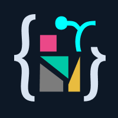

# Parsect



**Parsect** is an SVG-to-Canvas converter focused on clarity, performance, and control.  
It parses raw SVG markup and converts shapes, styles, and transforms into structured JSON that can be drawn using the Canvas `Path2D` API.

Built to serve developers who want clean, direct rendering without bloated libraries or black-box behavior.

---

## 🚀 Why Parsect?

Most SVGs are bloated. Most renderers are too generic.

Parsect focuses on **canvas-first SVG rendering**, optimized for games, apps, or visual tools where performance and predictability matter.  
It converts only what you need—shapes, paths, styles—and gives you full control over how they render.

---

## ✨ Features

- Converts SVG into structured JSON (shapes + styles)
- Outputs Canvas `Path2D` instructions
- Supports:
  - `path`, `rect`, `circle`, `ellipse`, `line`, `polygon`, `polyline`
  - `fill`, `stroke`, `opacity`, transforms
  - Linear gradients
- Skips unnecessary nodes for cleaner output
- Web-based visual tool: [parsect.zyrab.dev](https://parsect.zyrab.dev)

---

## 📦 Installation

_Coming soon: NPM package_

For now, clone or copy the repo:

```bash
git clone https://github.com/Zyrab/Parsect.git
```

🚀 Usage

```js
import { parseSVG, toPath2D, drawShape } from "./parsect/index.js";

// Your raw SVG string
const raw = `<svg viewBox="...">...</svg>`;

// Step 1: Parse it
const { paths } = parseSVG(raw);

// Step 2: convert and cache paths and stylings
const { dims, shapes } = toPath2D(path);

// shapes dimenstions that is very usfull with transformation and scaling
const width = dims.w;
const heigth = dims.h;

// step 3: in canvas u can draw using
drawShape(ctx, shape);
```

---

## Project Structure

```bash
/parsect
├── parser/       # → SVG -> JSON
├── renderer/     # → JSON -> Path2D
├── utils/        # → Gradient/style helpers
├── debug/        # → Shape isolators
└── index.js      # → Main export
```

---

## Roadmap

Chek to do file for to see where we are now

→ [Here](TODO)

---

## Built With

- Vanilla JS
- Canvas API
- Lots of SVG specs
- Curiosity & obsession with clean visual pipelines

---

## Who Made This?

Hi, I’m Zyrab.

I build tools, engines, and educational stuff—sometimes for kids, sometimes for devs like you.
This project is part of a larger effort to build [SVecter](https://github.com/Zyrab/SVecter): a 2D canvas game engine with SVG editing support.

- [Zyrab.dev](https://zyrab.dev)
- [Blogs](https://zyrab.dev/blog)

---

## Contributing

Pull requests are welcome!
If you're into optimization, graphics tooling, or just curious about SVG internals, feel free to help.

→ [Read the Contributing Guide](CONTRIBUTING).

---

## License

[MIT License](LICENSE)
